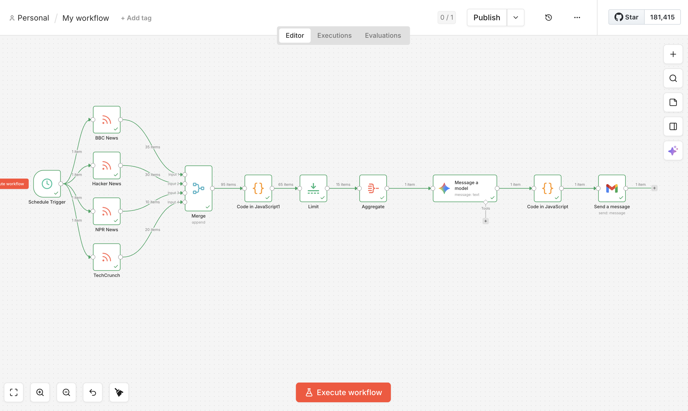

# Daily News Digest Agent — n8n + Gemini

An automated AI agent built with n8n that fetches top news 
from multiple RSS sources, summarizes them using Google Gemini, 
and delivers a daily HTML email digest every morning.

## Tools & Technologies
- **n8n** — workflow automation
- **Google Gemini API** (free tier) — AI summarization
- **RSS Feeds** — BBC, AP News, Hacker News, TechCrunch
- **Gmail** — email delivery
- **Google Sheets** — run logging (optional)

## Workflow Architecture
1. Schedule Trigger — fires every day at 7:00 AM
2. RSS Feed nodes — pulls articles from 4 sources in parallel
3. Merge — combines all feed items
4. Code node — filters articles from last 24 hours
5. Limit — keeps top 15 articles
6. Aggregate — bundles into single item for AI
7. Google Gemini — clusters and summarizes by topic
8. Code node — formats output as HTML email
9. Gmail — sends digest to inbox

## How to Run
1. Import `workflow.json` into your n8n instance
2. Add your Google Gemini API key
3. Add your Gmail credential
4. Activate the workflow

## Workflow Screenshot

